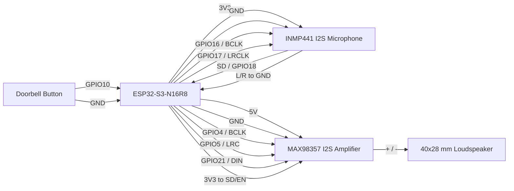

# DFLTech ESPHome Assistant

ESPHome firmware for an ESP32-S3-N16R8 voice assistant. It uses an INMP441 I2S microphone for capture and a MAX98357 I2S amplifier to drive a 40x28 mm 4/8 ohm loudspeaker.

The device integrates with Home Assistant Assist, so speech-to-text, text-to-speech, conversation agents, and AI integrations stay configured in Home Assistant. A physical doorbell button starts a voice session and notifies Home Assistant.

## Hardware

| Module | Module pin | ESP32-S3 pin | Notes |
|--------|------------|--------------|-------|
| INMP441 | VDD | 3V3 | Do not power from 5V |
| INMP441 | GND | GND | Shared ground |
| INMP441 | SCK | GPIO16 | Microphone I2S bit clock |
| INMP441 | WS | GPIO17 | Microphone I2S word select / LRCLK |
| INMP441 | SD | GPIO18 | I2S microphone data to ESP32 |
| INMP441 | L/R | GND | Selects left channel; firmware uses `channel: left` |
| MAX98357 | VIN | 5V | Use a stable 5V supply for better speaker volume |
| MAX98357 | GND | GND | Shared ground with ESP32 and microphone |
| MAX98357 | BCLK | GPIO4 | Speaker I2S bit clock (separate bus) |
| MAX98357 | LRC | GPIO5 | Speaker I2S word select / LRCLK (separate bus) |
| MAX98357 | DIN | GPIO21 | I2S speaker data from ESP32 |
| MAX98357 | SD / EN | 3V3 | Keep amplifier enabled |
| MAX98357 | GAIN | floating | Default gain; wire per module docs if needed |
| Loudspeaker | + | MAX98357 + | Speaker output only |
| Loudspeaker | - | MAX98357 - | Speaker output only |
| Doorbell button | one leg | GPIO10 | Other leg to GND; internal pullup enabled |
| Doorbell button | other leg | GND | Normally open push button |



The microphone and amplifier use **separate I2S buses** to avoid clock conflicts and audio glitches when switching between capture and playback.

## End Users

### Install Firmware

1. Download the latest `*.factory.bin` from GitHub Releases, or use the browser installer at `https://dflourusso.github.io/ha-esphome-assistant/`.
2. After flashing, the device creates a Wi-Fi access point named `dfltech-assistant-XXXXXX` (password: `dfltech-setup`).
3. Connect with your phone; the captive portal opens, or open http://192.168.4.1/.
4. Enter your home Wi-Fi credentials.
5. In Home Assistant, add the device via **Settings -> Devices & services -> ESPHome** (`dfltech-assistant-XXXXXX.local`).
6. Configure a Home Assistant Assist pipeline with STT, TTS, and your preferred conversation agent or AI integration.

### How to Talk to It

There is no wake word. Start a session in one of two ways:

- Press the physical **doorbell button** (GPIO10). This fires a Home Assistant event and starts an Assist session so you can speak to the visitor or the AI.
- Press the **Start Conversation** button entity in Home Assistant to start or stop a continuous session.

Example Home Assistant automation for doorbell notifications:

```yaml
automation:
  - alias: Assistant doorbell notification
    trigger:
      - platform: event
        event_type: esphome.dfltech_assistant_doorbell
    action:
      - service: notify.mobile_app
        data:
          title: Doorbell
          message: Someone pressed the doorbell
```

### OTA Updates

When a new version is published, Home Assistant shows a **Firmware** update on the device. Install from the device page or **Settings -> Updates**.

### Factory Reset

Hold the **BOOT** button (GPIO0) on the ESP32-S3 for **10 seconds**, then release. Wi-Fi credentials are cleared and the setup access point starts again.

## Developers

### Project Layout

```text
ha-esphome-assistant/
├── dfltech-assistant.yaml          # Core voice assistant firmware
├── dfltech-assistant.factory.yaml  # Distribution build (HTTP OTA + update entity)
├── dfltech-assistant.dev.yaml      # Local dev overlay (Wi-Fi + ESPHome OTA)
├── secrets.template.yaml           # Template for local secrets.yaml
├── static/                         # GitHub Pages installer site
└── .github/workflows/              # CI, release, and Pages deploy
```

### Local Compile

Factory image:

```bash
docker run --rm -v "$PWD:/config" ghcr.io/esphome/esphome:2026.6.2 compile dfltech-assistant.factory.yaml
```

Dev build:

```bash
cp secrets.template.yaml secrets.yaml
# edit secrets.yaml
docker run --rm -v "$PWD:/config" ghcr.io/esphome/esphome:2026.6.2 compile dfltech-assistant.dev.yaml
```

Or with ESPHome installed locally:

```bash
esphome compile dfltech-assistant.factory.yaml
```

### Publish a Release

1. Go to **Actions -> Release Firmware -> Run workflow**.
2. Enter a version, for example `1.0.0`, and optional release notes.
3. The workflow builds firmware, creates a GitHub Release with `.factory.bin` / `.ota.bin`, and deploys GitHub Pages with the OTA manifest.

The release workflow replaces `version: dev` in the factory YAML with the release version automatically.

OTA manifest URL: `https://dflourusso.github.io/ha-esphome-assistant/firmware/manifest.json`

## Home Assistant Integration

This device exposes:

| Entity | Purpose |
|--------|---------|
| Voice Assistant | Streams audio to Home Assistant Assist |
| Speaker (media player) | Plays TTS and supports `assist_satellite.announce` |
| Assist satellite | Remote Assist control and announcements |
| Doorbell | Physical button; fires `esphome.dfltech_assistant_doorbell` and starts Assist |
| Start Conversation button | Starts/stops a continuous voice session |
| Firmware update | Installs released HTTP OTA firmware |
| Restart / Safe Mode / Factory Reset buttons | Maintenance controls |
| WiFi Signal, Uptime, IP, SSID, MAC | Diagnostics |

Test speaker output from Home Assistant:

```yaml
action: assist_satellite.announce
target:
  entity_id: assist_satellite.dfltech_assistant_assist_satellite
data:
  message: "Teste de som"
```

Or use **Developer tools → Actions → Announce on satellite** after re-flashing.

For the "intelligence" layer, configure Home Assistant Assist with a pipeline that includes:

1. Speech-to-text.
2. A conversation agent, such as Home Assistant's default agent or an AI-backed agent.
3. Text-to-speech.

## Hardware Test Checklist

Use this checklist after flashing and wiring the device:

- [ ] **Wi-Fi provisioning** — captive portal AP appears; device joins home network.
- [ ] **Home Assistant pairing** — ESPHome integration connects; entities appear.
- [ ] **Doorbell button** — `binary_sensor.doorbell` turns on; `esphome.dfltech_assistant_doorbell` event fires in HA.
- [ ] **Assist session via doorbell** — pressing doorbell starts voice session; microphone input reaches HA.
- [ ] **Start Conversation button** — toggles continuous Assist session from HA.
- [ ] **Announce on satellite** — `assist_satellite.announce` plays a test message on the speaker.
- [ ] **TTS playback** — Assist responses play through the speaker clearly.
- [ ] **Volume** — speech is audible at normal distance; adjust `volume_multiplier` in YAML if needed.
- [ ] **Power stability** — no reboots or brownouts when speaker plays at volume (use stable 5V for MAX98357).
- [ ] **Factory reset** — hold BOOT (GPIO0) for 10 seconds clears Wi-Fi and restores setup AP.
- [ ] **Firmware OTA** — update entity installs a release build successfully.

## Troubleshooting

**No microphone input** — Check that INMP441 `L/R` is tied to GND. If you wire `L/R` to 3V3, change the firmware microphone channel from `left` to `right`.

**No speaker output** — Verify MAX98357 uses GPIO4 (BCLK), GPIO5 (LRC), and GPIO21 (DIN). Confirm SD/EN is tied to 3V3.

**Low speaker volume or resets while speaking** — Power the MAX98357 from a stable 5V supply and keep all grounds common. A weak USB port may brown out when the speaker draws current.

**Doorbell does not respond** — Confirm the button connects GPIO10 to GND when pressed. Check the Doorbell entity in Home Assistant.

**Audio glitches or crashes** — Avoid adding Bluetooth/BLE components to this firmware. ESPHome's audio and voice components use significant RAM and CPU.
